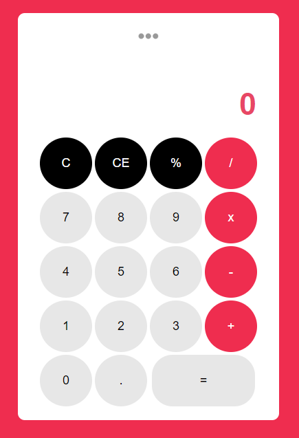

## Calculator 🧮
A simple, free modern calculator that can do basic calculation anytime. This web app is intended to help you understand simple parts of calculator in Vanilla ES5 Javascript.

### Screenshot


## Features of this Calculator ✨
* Add ➕ number
* Subtract ➖ numbers
* Multiply ✖️ numbers
* Divide ➗ numbers
* Can Get Percentage **%** of a number
* Has simple UI

## Get Started 🦄
* Clone the Repository
```
https://github.com/JolouTheRookie/Calculator.git 
```
* Analyze and Study the code
* Improve/Change the code
* Play around with the project

## Contribution 🔥
If you want to contribute to this project and make it better than i made then your pull request is very welcome. If you find some problem to this project then just put it in the issue page. Thank you 😊

### Thank you 😃
If you like this project just click ⭐ and share it with others.